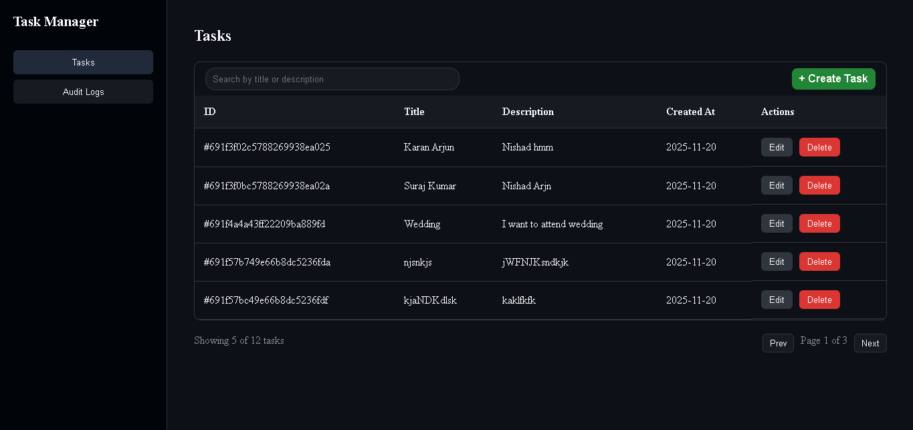
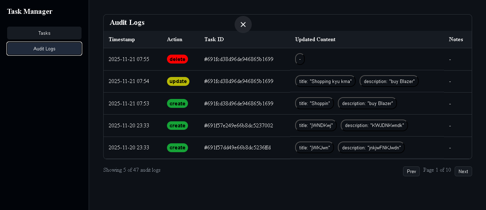

# Task Manager Project

## 🚀 Overview
**Task Manager** is a simple app that lets users create, update, delete, and view tasks with a clean UI. It includes login authentication, task history tracking (audit logs), search, and pagination, making task management easy and organized.

---

## 🛠 Tech Stack
### **Frontend**
- React

### **Backend**
- Node.js & Express
- REST API
- JWT Authentication

### **Database**
- MongoDB

### **Others**
- Cloud Storage (MongDb ATLAS)

---

## ✨ Features
### Frontend
- Responsive UI (works on mobile, tablet, and desktop)
- Task CRUD operations (create, edit, delete, view)
- Search + Pagination for easy task browsing
- Authentication-based access control
- Smooth modals & modern dashboard layout

### Backend
- User Signup & Signin with JWT Authentication
- Task CRUD API (Create, Read, Update, Delete)
- Audit Log System (tracks updates & deletions)
- Secure token handling via cookies
- Validation & Middleware-based Authorization

---

## 📂 Project Structure
```
project-root/
│
├── frontend/       # Frontend code (React)
├── backend/       # Backend code (Node.js/Express)
└── README.md     # This file
```

---

## ⚙️ Installation & Setup
Clone the repository:
```bash
git clone https://github.com/Suraj-nishad78/Task_Manager
cd Task_Manager
```

### **Frontend Setup**
```bash
cd frontend
npm install
npm run dev
```

### **Backend Setup**
```bash
cd backend
npm install
node index
```

---

## 🔑 Environment Variables
Create a `.env` file in both `frontend` and `backend` directories with the following variables:

### Frontend `.env`
```
VITE_API_URL=http://localhost:4000/
```

### Backend `.env`
```
PORT=4000
MONGOSERVER=your_mongo_database_url
PRIVATE_KEY=your_secret_key
```
---

## 📡 API Information
- Endpoints for Users:
  - `POST /api/users/signup`
  - `POST /api/users/signin`
  - `GET /api/users/getAll`

- Endpoints for Task:
  - `POST /api/tasks/createTask`
  - `GET /api/tasks/getAllTask`
  - `PATCH /api/tasks/updateTask`
  - `DELETE /api/tasks/deleteTask`
  
- Endpoints for Task:
  - `GET /api/tasks/getAuditTask`

---

## 📸 Screenshots

---

---

## 📞 Contact
- **Author:** Suraj Nishad
- **Email:** iamsuraj0737@gmail.com
